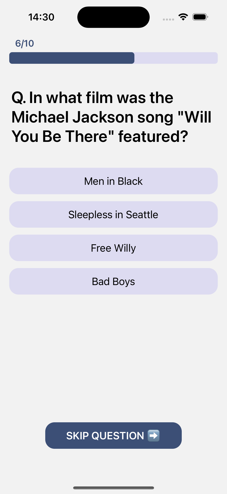
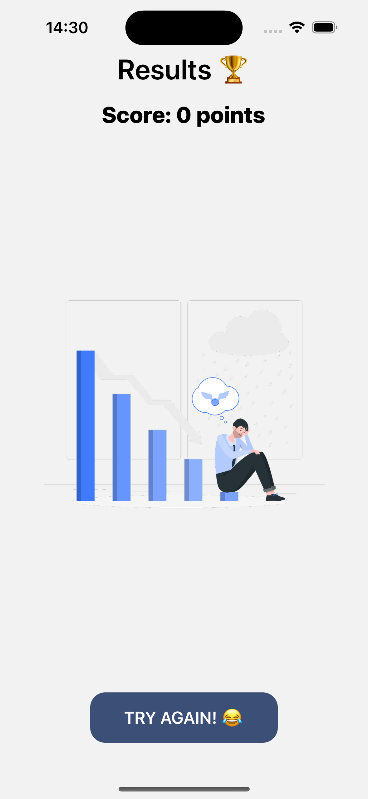
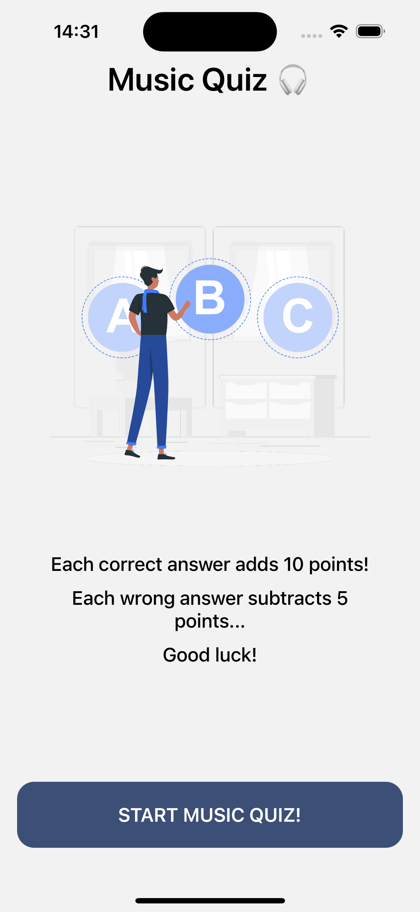

# QuizApp - Music Quiz

QuizApp is a music quiz application built using React Native. It fetches multiple-choice questions from the Open Trivia Database (OpenTDB) API, allowing users to test their knowledge of music. The app features dynamic question handling, a score system, and a progress bar to track the user's progress through the quiz.

## Features

- **Multiple-choice Questions**: Quiz questions are fetched dynamically from the Open Trivia Database API.
- **Score System**: Users gain or lose points based on correct and incorrect answers.
- **Progress Tracking**: A progress bar shows the user's progress through the quiz.
- **Real-time Feedback**: Immediate feedback is provided on correct or incorrect answers.
- **Responsive Design**: The app is optimized for mobile devices.

## Screenshots





Insert screenshots or GIFs of the app here to give viewers a visual idea of how your app works.

## Installation

To install and run this project locally, follow these steps:

1. **Clone the repository**

   ```bash
   git clone https://github.com/merttcetn/quizApp
   ```

2. **Navigate to the project directory**

   ```bash
   cd quizApp
   ```

3. **Install dependencies**

   If you're using npm:

   ```bash
   npm install
   ```

   Or if you're using yarn:

   ```bash
   yarn install
   ```

4. **Run the project**

   To run the app on an iOS or Android emulator, use:

   ```bash
   npx react-native run-ios
   ```

   or

   ```bash
   npx react-native run-android
   ```

## Technologies Used

- **React Native**: A framework for building native apps using React.
- **Open Trivia Database API**: Provides the quiz questions.
- **JavaScript/ES6**: Core programming language.
- **Expo CLI**: Development tool for React Native apps (optional).

## How to Use

1. Start the app, and it will automatically fetch 10 music-related multiple-choice questions.
2. Answer the questions by selecting one of the provided options.
3. Your score will be updated based on correct and incorrect answers.
4. Use the progress bar to track your progress through the quiz.
5. At the end of the quiz, your final score will be displayed.
